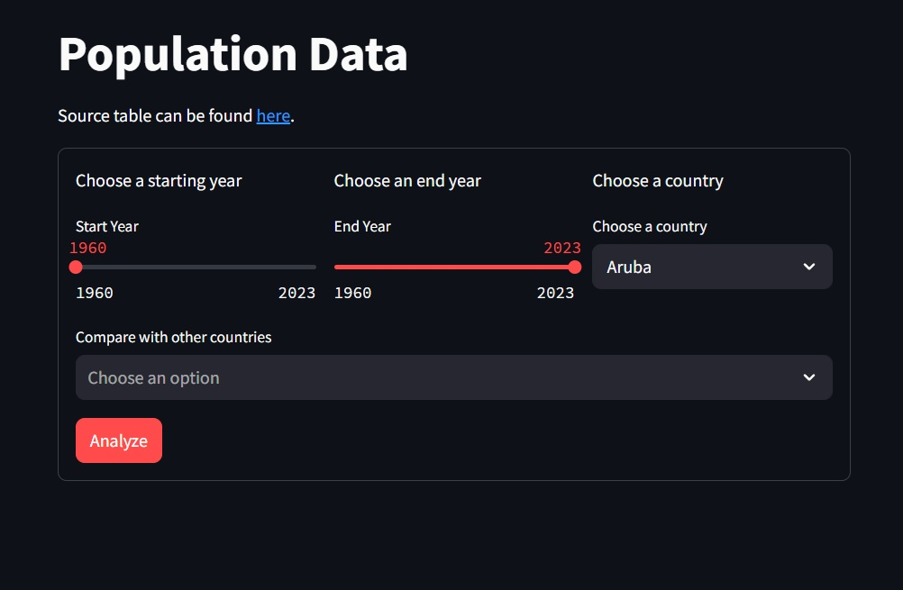
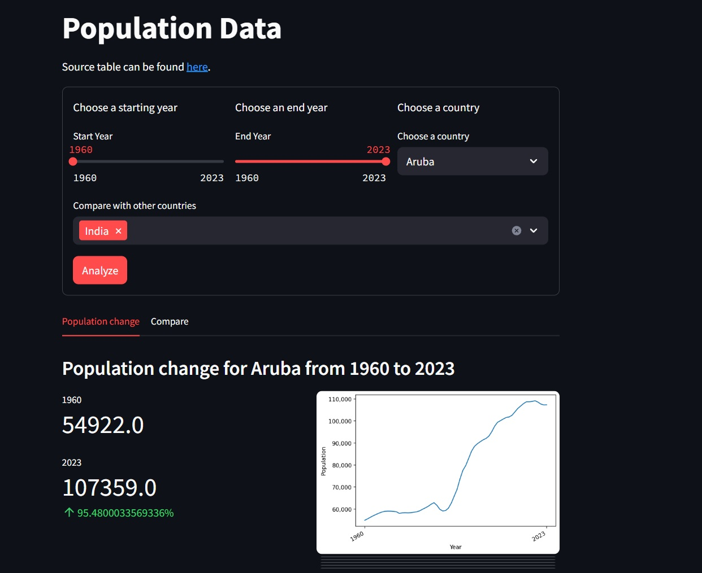
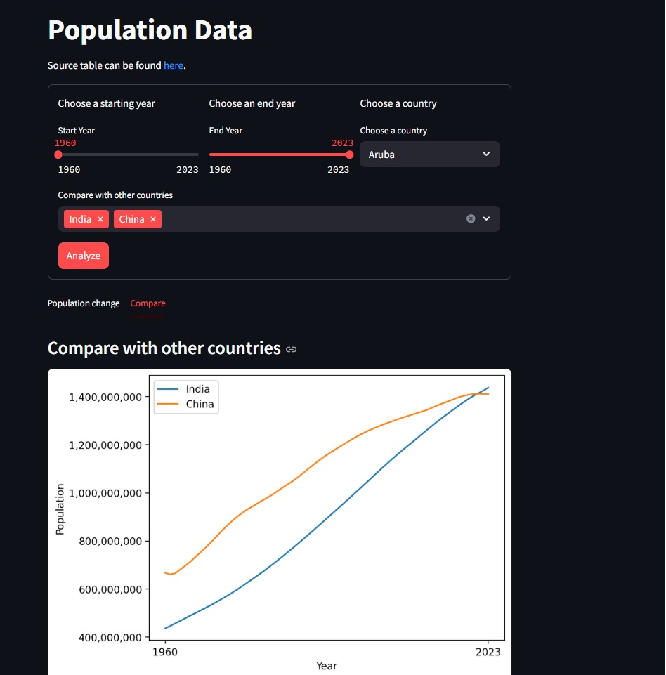

# 🌍 Streamlit-Simple-Population-Dasboard

Welcome to the **Streamlit-Simple-Population-Dasboard** – your interactive tool for visualizing and comparing population trends across the globe. Built with **Streamlit**, this app offers an intuitive, user-friendly interface to explore population changes over time and across multiple countries.

Whether you’re a researcher, policymaker, or data enthusiast, this dashboard lets you uncover meaningful insights about the world’s demographics. From historical trends to cross-country comparisons, we’ve got you covered.

  
*Explore global population data with ease.*

## 🚀 Key Features

- **🌐 Interactive Dashboard**: Visualize population trends dynamically for a seamless experience.
- **🧩 User-Friendly Interface**: Simple and intuitive interface, designed to make exploring demographic data effortless.
- **🔍 Comparative Analysis**: Compare population trends across different countries.
- **📊 Trend Visualization**: Visualize population data changes over time to spot key patterns.
- **💬 Facilitates Discussions**: Ideal for engaging discussions on demographic shifts with collaborators.

## 🔧 Requirements

To run this app on your local machine, you’ll need to install a few dependencies. You can get all of them by running:

```bash
pip install -r requirements.txt
```
- **Python 3.7 or higher**
- **Streamlit**
- **Pandas**
- **NumPy**
- **Matplotlib**


## 🚀 Installation Guide
Ready to dive in? Here’s how to set up the dashboard on your machine:

1. Clone the Repo:
First, clone this repository to your local environment:
```bash
git clone https://github.com/yourusername/population-dashboard.git
```
2. Navigate to the Project Directory:
Move into the project folder:

```bash
cd population-dashboard
```
3. Install Dependencies:
Install the necessary libraries with:

```bash
pip install -r requirements.txt
```
4. Prepare the Data:
Download the `population.csv` dataset from the World Bank and place it in the `data` folder.

.

## 🎯 How to Use
Once everything is set up, launching the app is a breeze:

1. Run the Streamlit app with:

```bash
streamlit run app.py
```
2. Open the dashboard in your web browser (usually accessible at http://localhost:8501).

3. Customize Your View:

- Choose a Country: Select a country from the dropdown to analyze its population data.

- Set Your Date Range: Use the interactive sliders to choose the starting and ending years for your analysis.

- Compare with Other Countries: Add countries to compare with, and instantly see how different populations have changed over time.


## 📝 Opening Page Breakdown
When you first open the Population Data Analysis Dashboard, you'll see the following components:

1. ### Page Header:
- **"Population Data"**: This is the title displayed at the top, highlighting the purpose of the tool – to explore population data.

- **Source table link:** A clickable link labeled **"Source table can be found here"** directs users to the original data source for transparency.

2. ### User Input Form:
The form consists of several interactive input fields:

- **Choose a Starting Year**:
This slider allows you to select the start year for the population data. The range is from 1960 to 2023, with the default starting at 1960.
    - **Interactive Slider**: The slider lets users easily select a year between 1960 and 2023 by sliding a red dot across the bar.

- **Choose an End Year**:
Similar to the starting year slider, this allows you to select the end year for the population data. The slider adjusts between 1960 and 2023.

- **Choose a Country**:
A dropdown list where users can select a country to analyze its population data. The dropdown is populated with country names, and the default option is Aruba.

- **Compare with Other Countries**:
Another dropdown menu that allows you to choose additional countries for comparison. This feature enables a side-by-side analysis of population trends across multiple countries.

- **Analyze Button**:
After filling in the input fields, users click the Analyze button to generate the population data visualizations based on their selections. Clicking this triggers the dashboard to display the selected country’s data, as well as any comparisons between selected countries.

- **Visual Elements**:
The page layout is designed to be **clean and simple**, with clear labels for each input field. This allows for an efficient and user-friendly experience while ensuring ease of use for both novice and advanced users.

- The **sliders** and **dropdown menus** are interactive and intuitive, with the red dot on the sliders indicating the current year selection.
3. ### Analyze Data for a Single Country:
If you want to analyze data for just one country, follow these steps:

- Select your **starting year** and **end year** using the sliders.

- Choose a **country** from the dropdown (e.g., **Aruba** in the image).

- The **Compare with Other Countries** dropdown can be left empty or you can add other countries for comparison.

- Once you've made your selections, click the **Analyze** button.

The dashboard will then display the population change for the selected country, showing:

- The **initial population** in the starting year and the **final population** in the end year.

- The **percentage change** between the two years.

- A **line graph** showing the **population trends** from the starting year to the end year.

In the example below, we are analyzing Aruba from 1960 to 2023:

- 1960 Population: 54,922

- 2023 Population: 107,359

- Percentage Change: 95.48%

Population Growth Visualization: A line graph displays the growth of the population from 1960 to 2023.
  
*Beautiful and intuitive charts for your demographic data.*

4. ## Compare Population Data Between Two Countries:
The dashboard also supports comparing population data between two countries. Here’s how to use it:

- Select your **starting year** and **end year** using the sliders.

- Choose a **country** from the dropdown (e.g., **India** in the image).

- In the **Compare with Other Countries dropdown**, select the **countries** you wish to compare. For example, you can select **India** and **China**.

- Once you’ve made your selections, click the **Analyze** button.

The dashboard will display the population trends for both countries (e.g., **India** and **China**) over the specified years in a side-by-side line graph. You can visually compare how the populations of these countries have evolved over time.

- In the example below, we are comparing the population changes of India and China from 1960 to 2023:

- India’s Population: Starting at 600 million in 1960 and rising steadily to over 1.4 billion by 2023.

- China’s Population: Growing from about 600 million in 1960 and surpassing 1.4 billion by 2023.

The line graph will show both trends for easy visual comparison.
  
*Compare population growth between India and China.*

.

## 📊 Code Walkthrough
### PopulationAnalyzer Class
This is the backbone of the app. It loads the population data and filters it based on the country and year range selected by the user. The class provides an easy-to-use method to get the relevant data for any analysis.

```python
class PopulationAnalyzer:
    def __init__(self, data_path):
        self.df = pd.read_csv(data_path, dtype={
            'Country Name': str,
            'Country Code': str,
            'Year': np.int32,
            'Value': np.float32
        })

    def get_population_data(self, country_name, start_year, end_year):
        return self.df[(self.df['Country Name'] == country_name) &
                       (self.df['Year'] >= start_year) &
                       (self.df['Year'] <= end_year)]

```
## PopulationDashboard Class
The dashboard is built around Streamlit and contains the logic for rendering the user interface. It displays population change data, as well as a comparison view where users can view trends for multiple countries side by side.

```python
class PopulationDashboard:
    def __init__(self, analyzer: PopulationAnalyzer):
        self.analyzer = analyzer

    def display_dashboard(self, country_name, start_year, end_year, comparison_countries):
        tab1, tab2 = st.tabs(["Population change", "Compare"])

        with tab1:
            self._display_population_change(country_name, start_year, end_year)

        with tab2:
            self._display_comparison(country_name, start_year, end_year, comparison_countries)

```
## Interactive User Interface
The app is built for simplicity. With just a few clicks, users can filter the data, select countries, and set the year range to see instant results.

```python
with st.form("population-form"):
    st.write("Choose a starting year")
    st.session_state.start_year = st.slider("Start Year", min_value=1960, max_value=2023, value=st.session_state.start_year)
    st.write("Choose an end year")
    st.session_state.end_year = st.slider("End Year", min_value=1960, max_value=2023, value=st.session_state.end_year)
    st.write("Choose a country")
    st.session_state.country_name = st.selectbox("Choose a country", options=analyzer.df['Country Name'].unique())
    st.session_state.comparison_countries = st.multiselect("Compare with other countries", options=analyzer.df['Country Name'].unique())
    submit_btn = st.form_submit_button("Analyze")
```

## 💡 Contributing
We encourage open-source collaboration! If you have ideas for new features, bug fixes, or improvements, feel free to contribute by opening an issue or submitting a pull request.

Here’s how you can contribute:

- Fork the repo

- Make your changes

- Open a pull request


Ready to start analyzing population trends?
Dive in and explore the world’s demographic shifts with the Population Data Analysis Dashboard! We hope this tool provides you with the insights you need to understand population changes over time.


